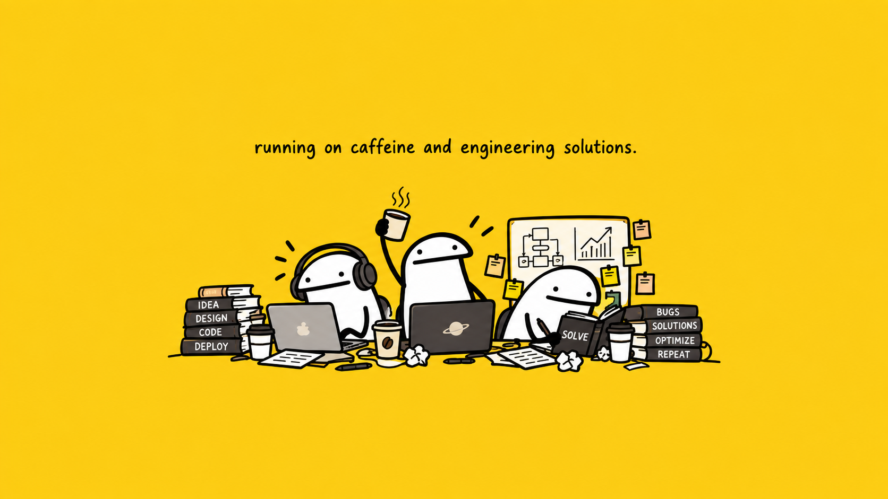

<div align="center">
  
</div>

<br/>

# PRABS25

### AI/ML Research • Computer Vision • Engineering Software • Embedded Systems

Building practical systems across machine learning, vision, automation, data analysis, and desktop engineering.


</div>

---

## About

I work across applied AI and engineering, with a focus on turning research ideas into systems that can be measured, tested, and used.

Current areas of interest include:

- Transformer architectures and efficient attention
- Computer vision and facial / gesture understanding
- Biomedical image classification
- Local AI systems and document intelligence
- Engineering data analysis and visualization
- Windows desktop applications and automation
- Embedded systems, sensors, cameras, and ESP32-class hardware

---

## Research Focus

### Adaptive Top-K Sparse Attention for Swin Transformer V2

My current research explores stage-aware sparse intra-window attention for Swin Transformer V2, including:

- fixed and adaptive Top-K attention
- straight-through estimation for discrete selection
- entropy-aware retention
- stage sensitivity analysis
- predictive and efficiency evaluation
- biomedical image classification

The goal is to study how much dense attention is actually needed, where sparsity is safe, and how attention structure affects predictive performance and computational efficiency.

---

## Engineering Areas

| Area | Focus |
|---|---|
| **AI / Machine Learning** | Transformers, sparse attention, classification, model evaluation |
| **Computer Vision** | MediaPipe, facial landmarks, blendshapes, gesture recognition |
| **Research Computing** | PyTorch, experimentation, metrics, reproducibility |
| **Data Engineering** | Polars, Excel automation, geometric classification, plotting |
| **Desktop Software** | Python Windows applications, engineering tools, local-first workflows |
| **Local AI** | Ollama, OCR, PDF intelligence, local inference pipelines |
| **Embedded Systems** | ESP32, cameras, sensors, lighting and hardware integration |

---

## Technology Stack

### AI, ML & Scientific Computing


### Data & Applications


### Tools & Platforms


---

## Projects Being Built

### AI Mood Challenge
A real-time facial-expression game using MediaPipe facial geometry and blendshapes, with a path toward transformer-based temporal expression understanding.

### Test Analysis App
A Windows engineering application for importing raw test data, standardizing it into structured matrices, analyzing results, and producing repeatable reports and visualizations.

### Bin Classification & Plotting Tool
A geometry-driven application that classifies units into overlapping polygonal bins and provides interactive engineering plots and tabular outputs.

### Local PDF AI Agent
A fully local document-processing pipeline using OCR, structured extraction, local LLMs, and local embeddings for private PDF analysis.

### Chromadial
An RGB/CMYK color-matching and color-mixing application with hardware-output possibilities for physical RGB lighting.

### MediaPipe Vision Experiments
Real-time gesture recognition, hand tracking, facial landmarks, multi-face processing, and camera-based interaction experiments.

---

## Current Technical Direction

```text
Efficient Transformers
        │
        ├── Sparse Attention
        ├── Adaptive Top-K
        ├── Computer Vision
        └── Biomedical Classification

Real-Time Vision
        │
        ├── Face Landmarks
        ├── Blendshapes
        ├── Gesture Recognition
        └── Multi-Face Temporal Modelling

Engineering Software
        │
        ├── Data Standardization
        ├── Visualization
        ├── Desktop Applications
        └── Local AI Workflows
```

---

## GitHub Activity

<div align="center">


</div>

---

## Engineering Philosophy

I prefer systems that are:

- measurable rather than assumed
- reproducible rather than one-off
- locally controllable when privacy matters
- technically explainable
- designed for future extension
- useful outside a demo environment

---

## What I Am Building Toward

A portfolio that connects **research, AI, software engineering, computer vision, data systems, and embedded hardware** into complete working systems rather than isolated experiments.

---

<div align="center">

### Explore. Measure. Build. Improve.


</div>
